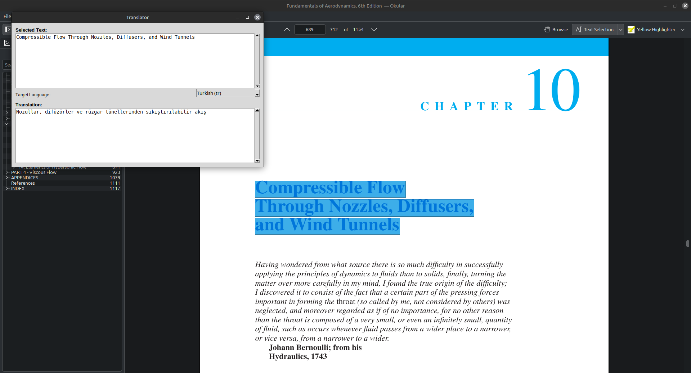

An instant popup translator for Linux desktop environments.  
Built with Python, Tkinter, and the Google Translate API (via `googletrans`) and made by ChatGPT.  
Select any text, copy it, hit a hotkey — and get the translation in a sleek popup window.

## ✨ Features

- 🖱️ Select or copy any text (e.g., in Okular or browser)
- 🎯 Press your custom hotkey (like `Ctrl+Shift+T`)
- 💬 Instantly see a popup with the original and translated text
- 📐 Automatically resizable window
- 🔃 Scrollable for long text
- 💡 Language auto-detect and selectable target language with last selection recognition
- 🧠 Lightweight & offline-capable

Installation Guide
=======================================

Step 1: Install required system packages
----------------------------------------
Open a terminal and run:

    sudo apt update
    sudo apt install python3-pip python3-tk xclip pipx

Step 2: Set up pipx (if not already)
------------------------------------
    pipx ensurepath

Then restart the terminal or source your shell config file:

    source ~/.bashrc   # or ~/.zshrc depending on your shell

Step 3: Install googletrans
---------------------------
    pipx install googletrans==4.0.0-rc1

This installs the translation library in an isolated environment.

Step 4: Clone the Repository
----------------------------
    git clone https://github.com/AxLxP/Pop-up-Translator.git
    cd Pop-up-Translator

Step 5: Make the Python script executable
-----------------------------------------
    chmod +x popup_translate.py

Step 6: Test it manually (optional)
-----------------------------------
Copy any text (Ctrl+C), then run:

    ~/.local/share/pipx/venvs/googletrans/bin/python3 popup_translate.py

A popup window should appear with the original and translated text.

Step 7: Create a Global Hotkey (for Cinnamon)
---------------------------------------------
1. Open: System Settings > Keyboard > Shortcuts > Custom Shortcuts
2. Click: "Add Custom Shortcut"
3. Name: Popup Translate
4. Command:

    ~/.local/share/pipx/venvs/googletrans/bin/python3 /full/path/to/popup_translate.py

5. Set hotkey: e.g., Ctrl+Shift+T

Now whenever you copy text and press your hotkey, the translator popup appears.

Done!
